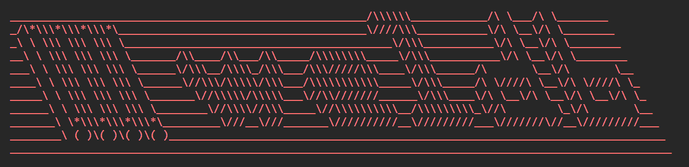

# weldb



Weld Map Database — a YAML-based format for 2D weld-map drawings that double as
the static weld record, for **boiler repair** projects. This repo ships as a
**Claude skill**: `SKILL.md` plus a bundled Python library, scripts, worked
examples, and reference specs, packaged into a single `weldb.skill` file.

Boiler repair work usually lacks good engineering drawings — the panels to be
replaced are chosen by the client, with engineering involved only in the repair
spec. `weldb` fills that gap: a single `.weldb` file is both the 2D weld-map
drawing and the authoritative weld record for a panel.

## File format

A `.weldb` file is YAML. It carries the panel's properties, an append-only
revision history (`maps`), and one or more views whose grids lay out the tubes,
membranes, and welds. See [references/drawing_spec.md](references/drawing_spec.md)
for the full format.

## How it's delivered — a skill (no PyPI)

This project is not published to PyPI. It is packaged as a self-contained
**skill**: the `weldb` Python library is bundled under `src/`, and the skill's
scripts add it to `sys.path` themselves, so nothing needs to be installed and no
network access is required.

```bash
python package.py          # -> weldb.skill  (a zip; load it as a skill)
```

`package.py` zips the whole project under a top-level `weldb/` folder, **except**
the desktop Tkinter app, the local example-render helper, `package.py` itself,
and build/cache/generated junk.

### What's in the skill

| Path | Purpose |
|------|---------|
| `SKILL.md` | Skill manifest + instructions (start here). |
| `scripts/` | CLI tools: `create_panel_extended_membrane`, `create_panel`, `create_panels`, `save_panel`, `archive_panel`, `render_pdf`, `render_revision_history`, `build_weld_csvs`, `query_welds`, `weld_positions_to_canvas`, `validate_welds`, `regenerate_artifacts`, `list_examples`. |
| `src/weldb/` | The bundled `weldb` library (the logic engine). |
| `examples/` | Worked `.weldb` arrangements to copy from. |
| `references/` | The format/rendering/naming specs and the HTML-editor guide. |
| `tests/` | Library test suite. |

## Scripts

Each script self-bootstraps the bundled library and has `--help`. Scripts that
render additionally need `fpdf2` (`pip install fpdf2`).

```bash
# Extended membrane style is the default; hot-side-only view. Renders on save.
python scripts/create_panel_extended_membrane.py N5 --mtrl "SA-210 A1" \
    --od 2.0 --wall 0.15 --units in --elevation "1850 in" --tube-start 250 --tube-end 254
python scripts/save_panel.py N5.weldb                 # after editing: validate + re-render PDF + rebuild CSVs
python scripts/create_panels.py --spec panels.json --out-dir ./project   # many panels in one process
python scripts/archive_panel.py N5.weldb              # retire a panel: move its whole file set to archive/
python scripts/query_welds.py N1 --csv-dir ./project  # pull one panel's welds from the CSVs (counts, or --format json/csv)
python scripts/weld_positions_to_canvas.py N1 --width 1200 --height 928  # PDF mm -> HTML5-canvas pixels (for a canvas-based tracker)
python scripts/validate_welds.py ./project            # check weld-ID uniqueness + naming across a project
python scripts/regenerate_artifacts.py ./project      # bulk: re-render CHANGED panels + rebuild CSVs
python scripts/list_examples.py
```

The `create_panel*` scripts produce the **conventional layout only** — a starting
scaffold with a single `hot_side` view. Edit the generated YAML (ports, clips,
area welds, dutchman repairs, weld-length overrides, dropped/offset tubes, extra
views, custom fields) to match the real panel, guided by the specs and examples.
Tubes are numbered left→right from the hot side; reverse views number in reverse.

**Always render on save (no opt-out):** a `.weldb` is never saved without its
derived artifacts. `save_panel.py` (and the `create_panel*` scaffolds) write the
YAML, re-render its PDF, and rebuild the project weld CSVs in the same step, so
they never go stale; run it after every edit. Weld coordinates (`x0, y0, x1, y1`,
leftmost view) live in the CSVs — there is no separate position JSON. To retire a
panel, `archive_panel.py` **moves** its whole file set into `archive/` rather than
deleting anything (never delete a panel). Use
`regenerate_artifacts.py` only to re-sync a whole directory in bulk.

## Editing a map visually

- **Interactive HTML editor** (works in a headless sandbox): build a
  self-contained HTML artifact that renders each view's grid as colored, editable
  cells and exports updated `.weldb` YAML. Guide + template:
  [references/html_artifact_editor.md](references/html_artifact_editor.md).
- **Desktop editor** (advanced, local machine only): `weldb_visual_editor.py` is
  a Tkinter app — `python weldb_visual_editor.py N5.weldb`. It needs a display,
  so it is kept out of the packaged skill and does not run headless.

## Library (logic engine)

The bundled `weldb` package is a pure content-in / content-out logic engine. To
use it directly, put `src/` on the path:

```python
import sys; sys.path.insert(0, "src")
import weldb

doc   = weldb.loads(content)               # parse .weldb text -> dict (validated)
welds = weldb.get_point_welds(doc)         # extract welds from the current map
props = weldb.resolve_weld_properties(doc) # effective per-weld properties
pdf   = weldb.render_pdf_bytes(doc)        # render to PDF bytes (needs fpdf2)
text  = weldb.dumps(doc)                   # serialize a dict back to .weldb text
```

Key functions: `loads`/`dumps`, `load`/`save`, `save_panel` (save + render the PDF
in one call), `archive_panel`, `add_revision`,
`get_point_welds`/`get_linear_welds`/`get_area_welds`, `resolve_weld_properties`,
`render_pdf`/`render_pdf_bytes`, `render_revision_history_pdf(_bytes)`,
`render_monospace`, `weld_positions`/`weld_positions_from_doc`,
`first_view_weld_boxes` (leftmost-view weld coordinates for the CSVs),
`weld_canvas_boxes` (those coordinates scaled to HTML5-canvas pixels),
`validate_project`/`validate_files` (weld-ID uniqueness + naming checks),
`to_json`/`to_csv`/`to_xlsx`, `build_weld_log`/`prefix_weld_id`, and the
`PointWeld`/`LinearWeld`/`AreaWeld` dataclasses. For local development it can also
be pip-installed from a checkout: `pip install -e ".[pdf,dev]"`.

## Example catalog

`examples/` holds worked `.weldb` panels, one folder per arrangement, each file
opening with a comment block explaining its layout.

| Folder | Demonstrates |
|--------|--------------|
| `conventional_panel_simplified_membrane_style/` | Baseline layout to copy from: vertical tubes joined by membrane bars. |
| `conventional_panel_extended_membrane_style/` | Conventional water-wall panel in the extended membrane style. |
| `antler_panel/` | Conventional panel whose two outermost tubes are bent away. |
| `adjacent_panels/` | Two panels side by side on the same wall. |
| `stacked_panels/` | Two panels stacked vertically on the same tubes. |
| `overlapping_panels/` | Stacked panels whose vertical coverage overlaps. |
| `panel_with_clips_and_two_views/` | Cold-side attachment clips across two views. |
| `port_panel/` | Plain-text port/opening labels (not welds). |
| `dutchman_single_tube/` | One tube's section replaced by a dutchman. |
| `dutchmen_single_tube_group/` | Scattered single-tube dutchmen across a wide panel. |
| `dutchman_used_to_replace_failed_weld/` | A dutchman redlined in via an appended revision. |
| `three_revision_panel/` | Append-only history across three revisions. |
| `complex_panel/` | Every weld type on one map. |
| `cladding_full_panel/` | A conventional panel fully clad after install. |
| `cladding_partial_panel/` | Cladding applied only over certain areas. |
| `cladding_repair/` | Existing tubes repaired with cladding. |
| `large_panel/` | Large single-view water-wall panel (30 tubes). |
| `transition_belt_panel/` | A mid-panel belt where alternating tubes transition. |

## Specs

- [references/drawing_spec.md](references/drawing_spec.md) — `.weldb` file format
- [references/render_spec.md](references/render_spec.md) — how weld maps are rendered
- [references/panel_naming_convention.md](references/panel_naming_convention.md) — panel naming
- [references/weld_naming_convention.md](references/weld_naming_convention.md) — recommended weld IDs
- [references/project_spec.md](references/project_spec.md) — project structure and file lifecycle
- [references/weldb_design_philosophy.md](references/weldb_design_philosophy.md) — design principles
- [references/html_artifact_editor.md](references/html_artifact_editor.md) — interactive HTML editor guide
